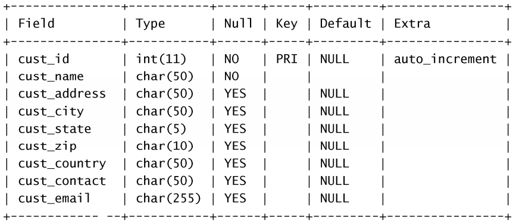

# MySQL必知必会

[TOC]


## 第一章  了解SQL

### 1.1 数据库基础

**1.1.1 什么是数据库**

**数据库：**保存有组织的数据的容器

**DBMS：** 数据库管理系统

**1.1.2 表**

**表（table）：**某种特定类型数据的结构化清单

**模式（schema）：**关于数据库和表的布局及特性的信息

**1.1.3 列和数据类型**

**列（column）：**表中的一个字段。所有表都是由一个或多个列组成的。

**数据类型 （datatype）：**所容许的数据的类型。每个表列都有相应的数据类型，它限制（或容许）该列中存储的数据。

**1.1.4 行**

**行：**表中的一个记录

**1.1.5 主键**

**主键 （primary key）：**一列（或一组列），其值能够唯一区分表中每个行。

表中的任何列都可以作为主键，只要它满足以下条件：

* 任意两行都不具有相同的主键值；

* 每个行都必须具有一个主键值（主键列不允许NULL值）。

### 1.2 什么是SQL

结构化查询语言（Structured Query Language）

## 第二章 MySQL简介

### 2.1  什么是MySQL

MySQL是一种DBMS

**2.1.1 客户机-服务器软件**

DBMS可分为两类：一类为基于共享文件系统的DBMS，另一类为基于客户机—服务器的DBMS。前者（包括诸如Microsoft Access和FileMaker）。MySQL、Oracle以及Microsoft SQL Server等数据库是基于客户机—服务器的数据库。

**2.1.2 MySQL版本**

### 2.2  MySQL工具

**2.2.1 mysql命令行实用程序**

**2.2.2 MySQL Administrator**

**2.2.3 MySQL Query Browser**

## 第三章 使用MySQL

### 3.1  连接

### 3.2 选择数据库

**关键字(key word)： **作为MySQL语言组成部分的一个保留字。决不要用关键字命名一个表或列。

```
USE crashcourese; #使用crashcourese数据库
```

### 3.3 了解数据库和表

```
SHOW DATABASES; #显示数据库名字信息
SHOW TABLES; #显示数据库内的表列表
```

```
SHOW COLUMNS FROM customers; 
DESCRIBE customer;
```



**自动增量：**某些表列需要唯一值。在每个行添加到表中时，MySQL可以自动地为每个行分配下一个可用编号，不用在添加一行时手动分配唯一值

```
SHOW STATUS，用于显示广泛的服务器状态信息；
SHOW CREATE DATABASE和SHOW CREATE TABLE，分别用来显示创建特定数据库或表的MySQL语句；
SHOW GRANTS，用来显示授予用户（所有用户或特定用户）的安全权限；
SHOW ERRORS和SHOW WARNINGS，用来显示服务器错误或警告消息。
```

## 第四章 检索数据

### 4.1  SELECT语句

### 4.2 检索单个列

```
SELECT prod_name
FROME products;
```

**不区分大小写**，所以可以用select或者SELECT

### 4.3 检索多个列

```
#多个列名，逗号分隔
SELECT prod_id, prod_name, prod_price
FROM products;
```

### 4.4 检索所有列

```
SELECT *
FROM products;
```

### 4.5 检索不同的行

```
SELECT DISTINCT vend_id
FROM products;
```

### 4.6 限制结果

```
SELECT prod_name
FROM products
LIMIT 5; #前五行

LIMIT 5, 5; #从行5开始的5行

MySQL 5 ：
LIMIT 4 OFFSET 3 #相当于LIMIT 3, 4,从行3开始取4行
```

行0 检索出来的第一行为行0而不是行1。因此，LIMIT 1, 1将检索出第二行而不是第一行。

行数不够就尽可能

### 4.7 使用完全限定的表名

```
SELECT prodcusts.prod_name
FROM crashcourse.products
```

## 第五章 排序检索数据

### 5.1 排序数据

**子句（clause）** 排序用ORDER BY子句。

```
SELECT prod_name
FROM products
ORDER BY prod_name;
```

通过非选择列进行排序 通常，ORDER BY子句中使用的列将是为显示所选择的列。但是，实际上并不一定要这样，用非检索的列排序数据是完全合法的。

### 5.2 按多个列排序

```
SELECT prod_id, prod_price, prod_name
FROM products
ORDER BY prod_price, prod_
```


