# MySQL必知必会

[TOC]


## 第一章  了解SQL

### 1.1 数据库基础

**1.1.1 什么是数据库**

**数据库：**保存有组织的数据的容器

**DBMS：** 数据库管理系统

**1.1.2 表**

**表（table）：**某种特定类型数据的结构化清单

**模式（schema）：**关于数据库和表的布局及特性的信息

**1.1.3 列和数据类型**

**列（column）：**表中的一个字段。所有表都是由一个或多个列组成的。

**数据类型 （datatype）：**所容许的数据的类型。每个表列都有相应的数据类型，它限制（或容许）该列中存储的数据。

**1.1.4 行**

**行：**表中的一个记录

**1.1.5 主键**

**主键 （primary key）：**一列（或一组列），其值能够唯一区分表中每个行。

表中的任何列都可以作为主键，只要它满足以下条件：

* 任意两行都不具有相同的主键值；

* 每个行都必须具有一个主键值（主键列不允许NULL值）。

### 1.2 什么是SQL

结构化查询语言（Structured Query Language）

## 第二章 MySQL简介

### 2.1  什么是MySQL

MySQL是一种DBMS

**2.1.1 客户机-服务器软件**

DBMS可分为两类：一类为基于共享文件系统的DBMS，另一类为基于客户机—服务器的DBMS。前者（包括诸如Microsoft Access和FileMaker）。MySQL、Oracle以及Microsoft SQL Server等数据库是基于客户机—服务器的数据库。

**2.1.2 MySQL版本**

### 2.2  MySQL工具

**2.2.1 mysql命令行实用程序**

**2.2.2 MySQL Administrator**

**2.2.3 MySQL Query Browser**

## 第三章 使用MySQL

### 3.1  连接

### 3.2 选择数据库

**关键字(key word)： **作为MySQL语言组成部分的一个保留字。决不要用关键字命名一个表或列。

```
USE crashcourese; #使用crashcourese数据库
```

### 3.3 了解数据库和表

```
SHOW DATABASES; #显示数据库名字信息
SHOW TABLES; #显示数据库内的表列表
```

```
SHOW COLUMNS FROM customers; 
DESCRIBE customer;
```


**自动增量：**某些表列需要唯一值。在每个行添加到表中时，MySQL可以自动地为每个行分配下一个可用编号，不用在添加一行时手动分配唯一值

```
SHOW STATUS，用于显示广泛的服务器状态信息；
SHOW CREATE DATABASE和SHOW CREATE TABLE，分别用来显示创建特定数据库或表的MySQL语句；
SHOW GRANTS，用来显示授予用户（所有用户或特定用户）的安全权限；
SHOW ERRORS和SHOW WARNINGS，用来显示服务器错误或警告消息。
```

## 第四章 检索数据

### 4.1  SELECT语句

### 4.2 检索单个列

```
SELECT prod_name
FROME products;
```

**不区分大小写**，所以可以用select或者SELECT

### 4.3 检索多个列

```
#多个列名，逗号分隔
SELECT prod_id, prod_name, prod_price
FROM products;
```

### 4.4 检索所有列

```
SELECT *
FROM products;
```

### 4.5 检索不同的行

```
SELECT DISTINCT vend_id
FROM products;
```

### 4.6 限制结果

```
SELECT prod_name
FROM products
LIMIT 5; #前五行

LIMIT 5, 5; #从行5开始的5行

MySQL 5 ：
LIMIT 4 OFFSET 3 #相当于LIMIT 3, 4,从行3开始取4行
```

行0 检索出来的第一行为行0而不是行1。因此，LIMIT 1, 1将检索出第二行而不是第一行。

行数不够就尽可能

### 4.7 使用完全限定的表名

```
SELECT prodcusts.prod_name
FROM crashcourse.products
```

## 第五章 排序检索数据

### 5.1 排序数据

**子句（clause）** 排序用ORDER BY子句。

```
SELECT prod_name
FROM products
ORDER BY prod_name;
```

通过非选择列进行排序 通常，ORDER BY子句中使用的列将是为显示所选择的列。但是，实际上并不一定要这样，用非检索的列排序数据是完全合法的。

### 5.2 按多个列排序

```
SELECT prod_id, prod_price, prod_name
FROM products
ORDER BY prod_price, prod_name;
```

### 5.3 指定排序方向

```
#默认升序（从A到Z）ASC
#降序DESC,只应用到前面那个
SELECT prod_id, prod_price, prod_name
FROM products
ORDER BY prod_price DESC, prod_id;
```

```
#order by + limit 最高或者最低
SELECT prod_price
FROME products
ORDER BY prod_price DESC
LIMIT 1;
```

## 第六章 过滤数据

### 6.1 使用WHERE子句

```
SELECT prod_name, prod_price
FROM products
WHERE prod_price = 2.50
#ORDER BY 应该在 WHERE后面
```

### 6.2 WHERE子句操作符

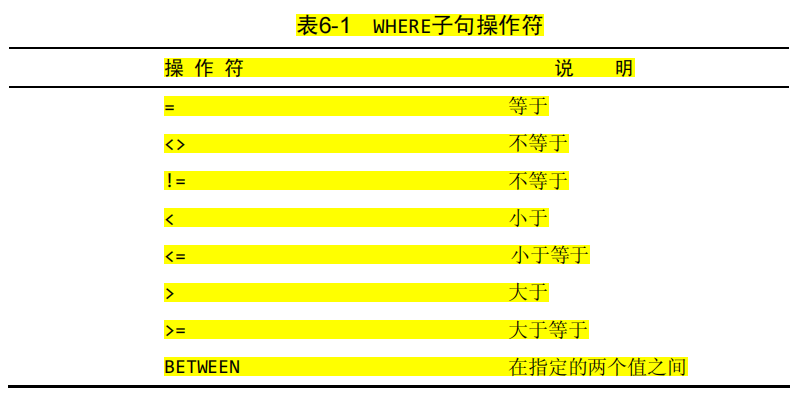

**6.2.1 检查单个值**

**6.2.2 不匹配检查** （<>, !=）

单引号用来限定字符串

**6.2.3 范围值检查**

```
SELECT prod_name, prod_price
FROM products
WHERE prod_price BETWEEN 5 AND 10;
```

**6.2.4 空值检查**

**NULL**:判断无值语句 IS NULL

```
SELECT prod_name
FROM products
WHERE prod_price IS NULL
```

## 第7章 数据过滤

### 7.1 组合WHERE子句

AND 和 OR

**7.1.1 AND操作符**

**7.1.2 OR操作符**

**7.1.3 计算次序**

用括号可以控制次序

### 7.2 IN操作符

IN操作符用来指定条件范围，范围中的每个条件都可以进行匹配。IN取合法值的由逗号分隔的清单，全都括在圆括号中。

```
SELECT prod_name, prod_price
FROM products
WHERE vend_id IN (1002, 1003)# 相当于 vend_id = 1002 OR vend_id=1003
ORDER BY prod_name;
```

### 7.3 NOT操作符

否定之后所跟的任何条件

```
SELECT prod_name, prod_price
FROM products
WHERE vend_id NOT IN (1002, 1003)
ORDER BY prod_name;
```

MySQL中的NOT MySQL支持使用NOT对IN、BETWEEN和EXISTS子句取反，这与多数其他DBMS允许使用NOT对各种条件取反有很大的差别。

## 第八章 用通配符进行过滤

### 8.1 LIKE操作符

**通配符（wildcard）** 用来匹配值的一部分的特殊字符。

**搜索模式（search pattern）**由字面值、通配符或两者组合构成的搜索条件。

**8.1.1 百分号（%）通配符**

%表示任何字符出现任意次数, NULL匹配不了

```
SELECT prod_id, prod_name
FROM products
WHERE prod_name LIKE "jet%";
#WHERE prod_name LIKE "%anvil%";
#WHERE prod_name LIKE "s%e"
```

**8.1.2 下划线（_）通配符**

_用途跟%一样，但是只能匹配一个字符

### 8.2 使用通配符的技巧

## 第九章 用正则表达式进行搜索

### 9.1 正则表达式介绍

### 9.2 使用MySQL正则表达式

**9.2.1 基本字符匹配**

`REGEXP`

匹配不区分大小写，为区分大小写，用BINARY

```
SELECT prod_name
FROM products
WHERE prod_name REGEXP BINARY '.000'
ORDER BY prod_name;
```

**9.2.2 进行OR匹配**

```
SELECT prod_name
FROM products
WHERE prod_name REGEXP '1000|2000|3000'
ORDER BY prod_name;
```

**9.2.3 匹配几个字符之一**

[123]意是是匹配1或者2或者3

```
SELECT prod_name
FROM products
WHERE prod_name REGEXP '[123] Ton' #相当[1|2|3],如果是 1|2|3 ton 则是三个分开，最后一个是3 ton
ORDER BY prod_name;
```

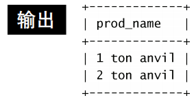

```
#取非，则是[^123]
```

**9.2.4 匹配范围**

[0123456789] 写成 [0-9] ，还有[a-z]

**9.2.5 匹配特殊字符**

为了匹配特殊字符，必须用\\为前导。\\-表示查找-，\\.表示查找.

```
SELECT vend_name
FROM vendors
WHERE vend_name REGEXP '\\.'
ORDER BY vend_name;
```

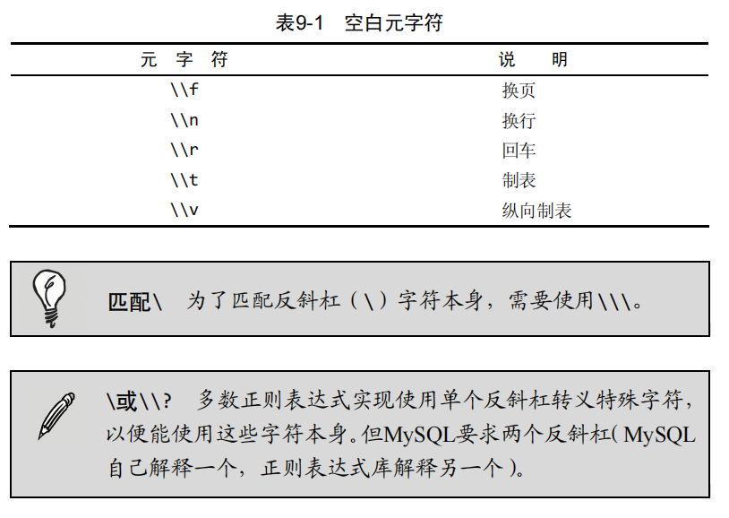

**9.2.6 匹配字符类**

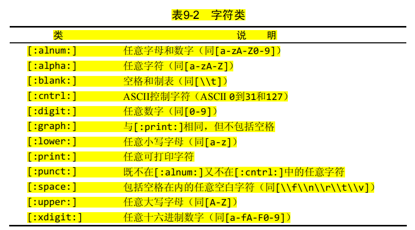

**9.2.7 匹配多个实例**

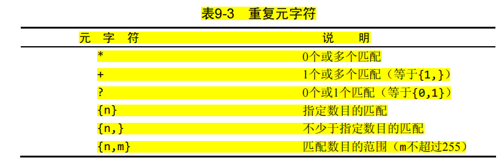

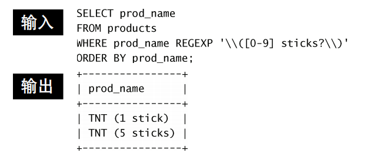

```
SELECT prod_name
FROM products
WHERE prod_name REGEXP '[[:digit:]]{4}'
ORDER BY prod_name;
```

**9.2.8 定位符**

上面都是匹配一个串任意位置的，可以进行定位

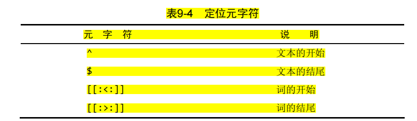

```
SELECT prod_name
FROM products
WHERE pro_name REGEXP '^[0-9//.]'
```

## 第十章 创建计算字段

### 10.1 计算字段

**字段（field）** 基本上与列（column）的意思相同，经常互换使用，不过数据库列一般称为列，而术语字段通常用在计算字段的连接上。

### 10.2 拼接字段

**拼接（concatenate）** 将值联结到一起构成单个值。

多数DBMS使用+或者||，MySQL使用**Concat()**

```
Concat(vend_name, ' (', vend_country, ')') #,是分割，所以有四个元素
```

```
SELECT Concat(vend_name, ' (', vend_country, ')')
FROME vendors
ORDER BY vend_name;
```

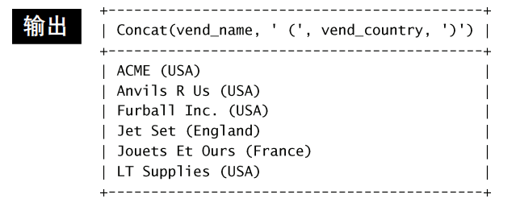

**RTrim()**:去掉右边的所有空格, 还有LTrim和Trim

```
SELECT Concat(vend_name, ' (', Rtrim(vend_country), ')')
FROME vendors
ORDER BY vend_name;
```

**使用别名** AS (又叫导出列)

```
SELECT Concat(Rtrim(vend_name), ' (', Rtrim(vend_country), ')') AS vend_title
FROME vendors
ORDER BY vend_name;
```

### 10.3 执行算术计算

+-*/

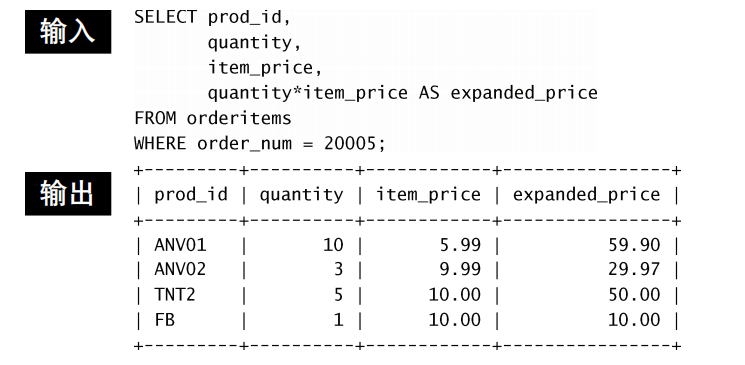

## 第11章 使用数据处理函数

### 11.1 函数

### 11.2 使用函数

**11.2.1 文本处理函数**

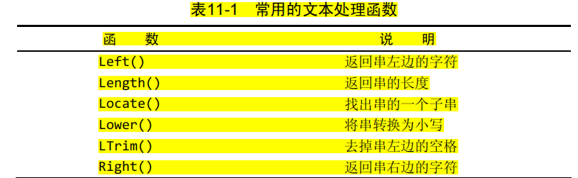


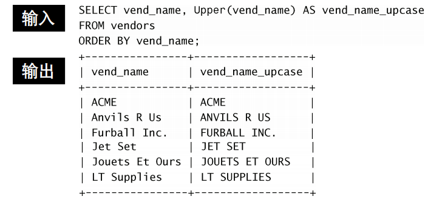

SOUNDEX是一个将任何文本串转换为描述其语音表示的字母数字模式的算法。

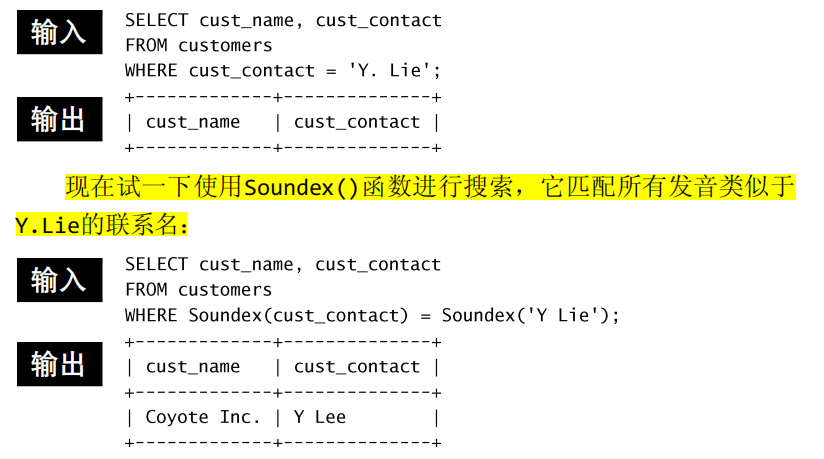

**11.2.2 日期和时间处理函数**

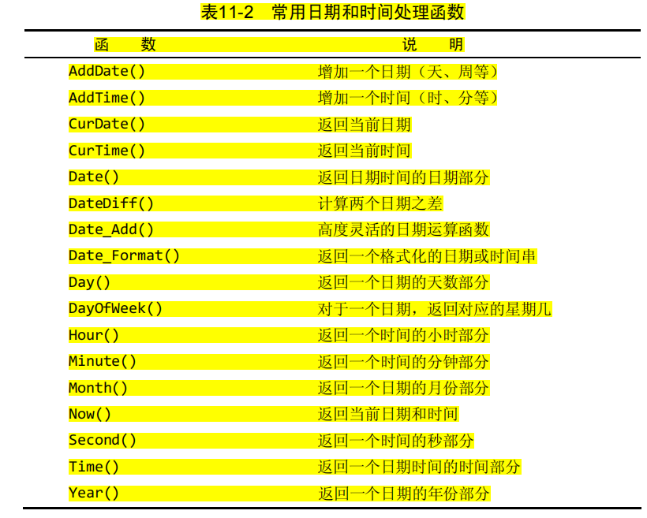

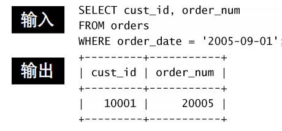

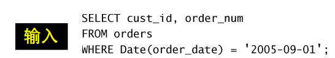

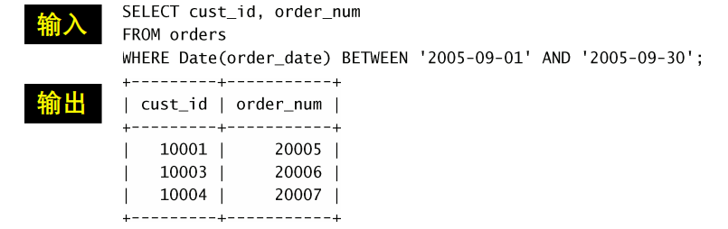

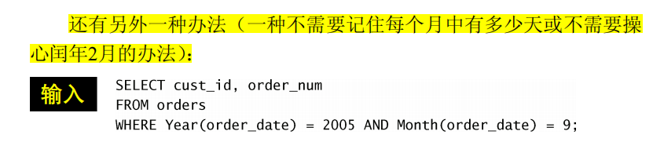

**11.2.3 数值处理函数**

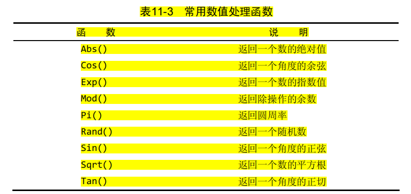

